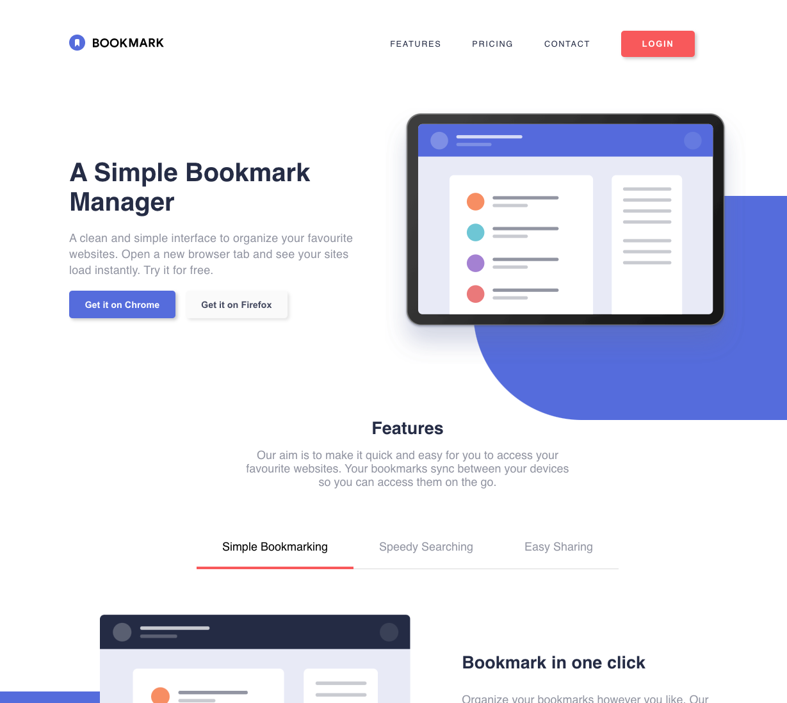

# Frontend Mentor - Bookmark landing page solution

This is a solution to the [Bookmark landing page challenge on Frontend Mentor](https://www.frontendmentor.io/challenges/bookmark-landing-page-5d0b588a9edda32581d29158). Frontend Mentor challenges help you improve your coding skills by building realistic projects. 

## Table of contents

- [Overview](#overview)
  - [The challenge](#the-challenge)
  - [Screenshot](#screenshot)
  - [Links](#links)
- [My process](#my-process)
  - [Built with](#built-with)
  - [What I learned](#what-i-learned)
  - [Continued development](#continued-development)
- [Author](#author)
- [Acknowledgments](#acknowledgments)

**Note: Delete this note and update the table of contents based on what sections you keep.**

## Overview

### The challenge

Users should be able to:

- View the optimal layout for the site depending on their device's screen size
- See hover states for all interactive elements on the page
- Receive an error message when the newsletter form is submitted if:
  - The input field is empty
  - The email address is not formatted correctly

### Screenshot

### Links

- Solution URL: [GitHub Link](https://github.com/supertrupert/bookmark-landing-page)
- Live Site URL: [Live Site](https://rupert.xyz/bookmark-landing-page/)

## My process

### Built with

- Semantic HTML5 markup
- CSS custom properties
- Flexbox
- Deskto-first workflow (want to use mobile-first next time)

**Note: These are just examples. Delete this note and replace the list above with your own choices**

### What I learned

- Learned about form validation
- Improved my layout skills a lot
- Learned basics of Javascript for the tab and accordion sections

**Note: Delete this note and the content within this section and replace with your own learnings.**

### Continued development

Want to get deeper into Javascript from now on. Feel pretty decent at this point with HTML/CSS.

## Author

- Website - [rupert.xyz](https://www.rupert.xyz)
- Frontend Mentor - [@supertrupert](https://www.frontendmentor.io/profile/supertrupert)
- Twitter - [@rupertxyz](https://twitter.com/rupertxyz)
